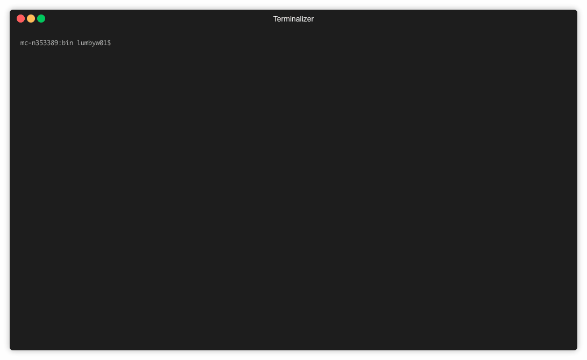

# 5eSimulator
#### A combat and DPT simulator for Dungeons and Dragons 5th Edition. 

Leverages Golang and character sheets represented as JSON to simulate 
simple one-on-one combat encounters using the 5e ruleset.

### Setup

Make sure you have Golang installed, and your JSON character sheets placed in
the `/sheets/` directory. Two examples can be seen there already.

### Usage



Navigate to `/bin/` and execute:
```
./run.sh
``` 
with Golang installed to start the simulator. The
program will search the sheets folder for JSON files it can use.

Select the two combatant JSON files and choose a number of simulation iterations.
1000-10000 is recommended for an optimal balance of speed and accuracy.
